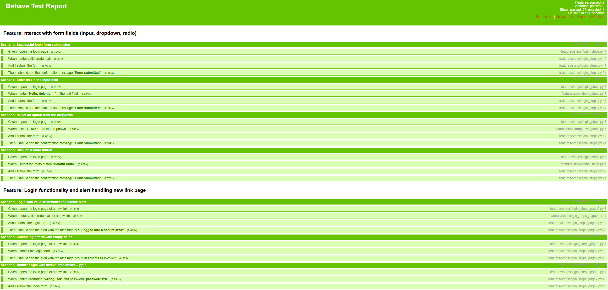

# Selenium Cucumber Python

This project uses **Selenium**, **Behave (Cucumber for Python)**, and **Pytest** to write and execute automated tests based on BDD (Behavior-Driven Development). Everything is integrated with **GitHub Actions** to automatically run tests and generate an HTML report accessible via **GitHub Pages**.

## Project Goal
The goal of this project is to **practice test automation** and demonstrate my QA engineering skills using Selenium and BDD practices.

To achieve this, I automated real interactions on two public websites:

1. [Selenium Web Form](https://www.selenium.dev/selenium/web/web-form.html) – testing forms, dropdowns, radio buttons.
2. [HerokuApp Login Page](https://the-internet.herokuapp.com/login) – testing login flows and alert messages.

The current test coverage includes:

- ✅ Valid and invalid login attempts
- ✅ Input validation and alert handling
- ✅ Form submission with text input
- ✅ Dropdown and radio button interactions

> Each test scenario is written using the Gherkin language and implemented with Behave step definitions.

Example:

```gherkin
Feature: Login Functionality

  Scenario: Successful login form submission
    Given I open the login page
    When I enter valid credentials
    And I submit the form
    Then I should see the confirmation message "Form submitted"
```

---

## Requirements
Make sure you have **Python 3.10+** installed. All necessary dependencies are listed in `requirements.txt` and can be installed with:

```sh
pip install -r requirements.txt
```

### Main Dependencies:
- **Selenium 4.28.1** → For browser automation
- **Behave 1.2.6** → For writing tests in Gherkin style
- **WebDriver Manager 4.0.2** → For automatic browser driver management
- **Behave HTML Formatter 0.9.10** → To generate HTML test reports

---

## Installation & Running Tests
After installing the dependencies, you can manually run the tests with:

```sh
behave -f html -o reports/report.html
```

Tests can be automatically executed through **GitHub Actions** whenever a push or pull request is made to the `main` branch.

### Running Locally
To run the project locally, follow these steps:

1. **Clone the repository**
   ```sh
   git clone https://github.com/riacono91/selenium-cucumber-python.git
   cd selenium-cucumber-python
   ```
2. **Create and activate a virtual environment**
   ```sh
   python -m venv venv
   source venv/bin/activate  # On macOS/Linux
   venv\Scripts\activate  # On Windows
   ```
3. **Install dependencies**
   ```sh
   pip install -r requirements.txt
   ```
4. **Run the tests**
   ```sh
   behave -f html -o reports/report.html
   ```

---

## GitHub Actions - Test Automation
I have set up a workflow in `.github/workflows/selenium-test.yml` that automatically runs tests.

### Workflow Steps:
1. Checkout the repository
2. Setup Python environment (3.10)
3. Install dependencies
4. Setup **ChromeDriver** to run Selenium tests
5. Execute Behave tests
6. Upload test results as an artifact
7. Deploy the report to **GitHub Pages**

---

## Test Report
Test results are saved in HTML format and published via GitHub Pages.

**[View Test Report](https://riacono91.github.io/selenium-cucumber-python/report.html)**


---

## License
This project is public and available on [GitHub](https://github.com/riacono91/selenium-cucumber-python).

If you have suggestions or want to discuss implementations, feel free to open an **issue** in the repository!

